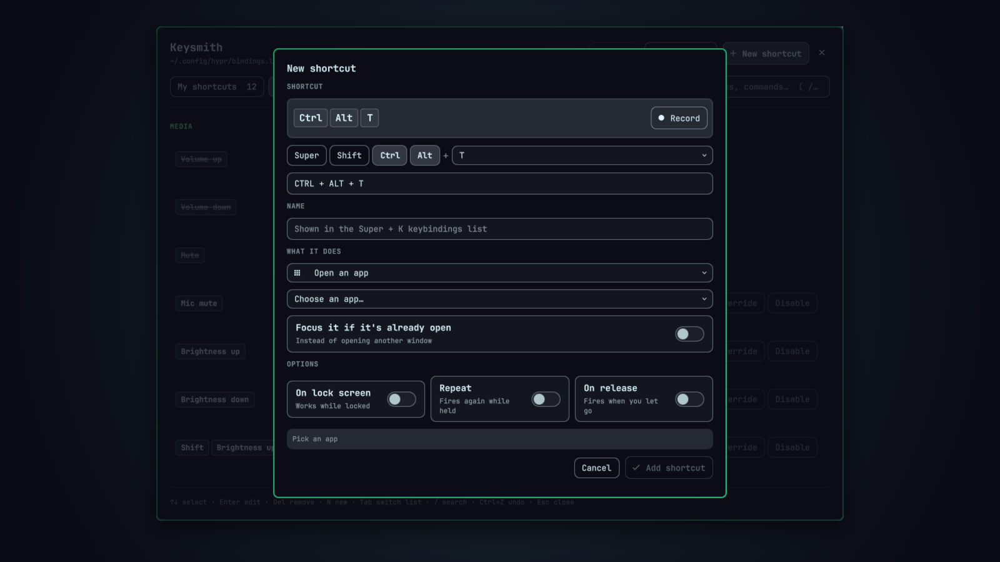

# Keysmith

**A GUI for your Hyprland keyboard shortcuts on Omarchy.**



Keysmith is an Omarchy shell app for viewing, adding, editing and removing
the shortcuts in `~/.config/hypr/bindings.lua`, without hand-writing Lua.

## Install

```bash
omarchy plugin add https://github.com/XenoUniv3rse/keysmith.git --enable --yes
```

While the plugin is enabled, Keysmith keeps `keysmith.desktop` in
`~/.local/share/applications/`, so **Super + Space** finds it by name. Disabling
the plugin takes the entry away again. Only a file carrying the
`X-Keysmith-Managed=true` marker is ever written or deleted, so a
`keysmith.desktop` of your own is left alone.

## Remove

```bash
omarchy plugin remove ebirkhoff.keysmith --yes
```

Your shortcuts stay: they are plain Lua in `~/.config/hypr/bindings.lua`.
Backups Keysmith made are next to it as `bindings.lua.bak.keysmith.*`, and
you can delete them whenever you like.

## Open it

- **Super + Space**, type *Keysmith*, or
- `omarchy-shell shell toggle ebirkhoff.keysmith`, or
- bind it to a key — from inside Keysmith: *New shortcut › Toggle a shell plugin / panel › Keysmith*.

Keysmith opens as an ordinary window titled *Keysmith*, so Hyprland tiles it
like any other app. To have it float, centred, add this to
`~/.config/hypr/hyprland.lua`:

```lua
o.window({ class = "^org\\.quickshell$", title = "^Keysmith$" }, { tag = "+keysmith-window" })
o.window({ tag = "keysmith-window" }, { float = true })
o.window({ tag = "keysmith-window" }, { center = true })
o.window({ tag = "keysmith-window" }, { size = { 1000, 720 } })
```

## What it does

- **My shortcuts** — everything in `bindings.lua`, with which Omarchy default
  each one replaces.
- **Omarchy defaults** — every default binding, with *Override*, *Disable* and
  *Re-enable*.
- **Editor** — record the shortcut by pressing it, or pick modifiers + a key
  from a searchable list, or type it (`SUPER + SHIFT + E`). Conflicts are shown
  before you save, and the needed `hl.unbind` is added for you.

### Actions

| Action | Writes |
|---|---|
| Open an app (optionally focus if running) | `{ launch = "app.desktop" }` |
| Open a web app | `{ webapp = "https://…" }` |
| Open a link, file or folder | `xdg-open …` |
| Run a command (background / terminal / as app) | `"cmd"`, `{ tui = … }`, `{ launch = … }` |
| Type text | `wtype -s <delay> -- '…'` |
| Play a keyboard macro | one `wtype` command with per-step delays (see below) |
| Window & workspace | `hl.dsp.window.*`, `hl.dsp.focus(…)` |
| Media, volume & brightness | Omarchy audio/brightness commands |
| Screenshot & capture | Omarchy capture commands |
| System & notifications | lock, suspend, reboot, notifications… |
| Toggle a shell plugin / panel | `omarchy-shell shell toggle <id>` |
| Open an Omarchy menu | `omarchy-menu toggle <menu>` |
| Omarchy toggle | `omarchy-toggle-<name>` |
| Do nothing (block the key) | `"true"` |
| Custom Lua dispatcher | any `hl.dsp.…` expression |

Options: works on lock screen, repeat while held, fire on release.

### Keyboard macros

Pick **Play a keyboard macro** and press **Record**, then perform the keys.
Every press and release is recorded with the time between them. Click
**Stop** when you're done.

- **Timeline.** Each step has a delay (ms, before the step) and a kind: tap,
  press, release or type text. You can edit, reorder, delete or add steps.
- **Tools.**
  - *Slower ×2*, *Faster ×2*, *Round to 50 ms* and *No delays* change every
    delay at once.
  - *Start after* waits for you to let go of the trigger shortcut before the
    macro begins.
  - *Repeat* plays the whole macro 1–100 times.
- **Test** plays the macro into a box inside the editor.
- **Stopping.** The *System › Stop running macros* action (`pkill -x wtype`)
  gives you a panic key.

A macro is saved as a single `wtype` command, e.g.
`wtype -s 300 -M ctrl -s 120 -k s -m ctrl`. The shortcut keeps working without
Keysmith, and Keysmith reads it back into steps for editing.

Limits:
- Recording only sees keys typed into Keysmith's recorder, because Wayland
  doesn't let apps read the keyboard globally.
- Combos Hyprland itself uses (like Super + a key) can't be recorded. Add them
  as steps instead.
- Playback goes to whichever window is focused. Some games that read raw input
  ignore virtual keyboards.
- Keyboard only, no mouse.

You can start recording from a shortcut or script:

```bash
omarchy-shell shell summon ebirkhoff.keysmith '{"new":true,"type":"macro","record":true}'
```

### Keys

| | |
|---|---|
| `↑` `↓` / `j` `k` | select |
| `Enter` | edit |
| `Del` | remove |
| `N` | new shortcut |
| `Tab` | switch list |
| `/` | search |
| `Ctrl+Z` | undo |
| `Esc` | close |

## How it works

- **Reading.** `scan.lua` runs your real `hyprland.lua` against recording
  stubs for `hl` and `o`. Loops, `require`s and helpers resolve exactly as in
  Hyprland, so the list matches what Hyprland registers.
- **The scan is sandboxed.** While your config runs for the scan, anything
  that would reach outside the process is a no-op:
  - Commands (`os.execute`, `io.popen`) report failure without running.
  - File writes, deletes and renames pretend to succeed but touch nothing.
  - `os.exit` and native (C) modules are blocked.
  - The `debug` library is withheld (only `debug.traceback` remains), so the
    config can't pull the scanner's real `io.open` out of its closures.
  - Code loads from text only: no precompiled bytecode through `load`,
    `loadfile`, `dofile` or `require`, and `string.dump` is blocked.
  - Output the config prints is ignored, and it can't close the scanner's
    stdout.

  Reading files and loading Lua modules still work. So opening Keysmith never
  repeats your config's side effects. A module that fails under the stubs is
  skipped with a warning, rather than hiding every shortcut after it.
- **Writing.** Keysmith rewrites only the exact source lines of plain
  top-level `o.bind` / `hl.bind` / `hl.unbind` calls. It shows bindings built
  in loops, functions or other files, but leaves those for hand-editing.
- **Safety.**
  - It backs up `bindings.lua` (`bindings.lua.bak.keysmith.<timestamp>`) before
    its first write in each session.
  - After every save it runs `hyprctl reload` and `hyprctl configerrors`. If
    the change introduces a new error, the file is reverted automatically.
  - There's an Undo button.
- **Typing text.** A key you're still holding (like Super) merges into text
  that `wtype` injects, so typing waits a short, configurable delay first.
- **Recording.** Combos Hyprland already uses are caught by Hyprland before
  they reach the panel. Pick those from the key list instead.

Needs `lua` (a Hyprland dependency). *Type text* needs `wtype`.

Tests:
- `test/sandbox.sh` checks that a config trying to run commands and touch
  files has no effect during a scan.
- `node test/run.js <scan.json>` checks the model against a real scan
  (`lua scan.lua ~/.config/hypr/hyprland.lua ~/.config/hypr/bindings.lua > scan.json`).

## License

MIT
